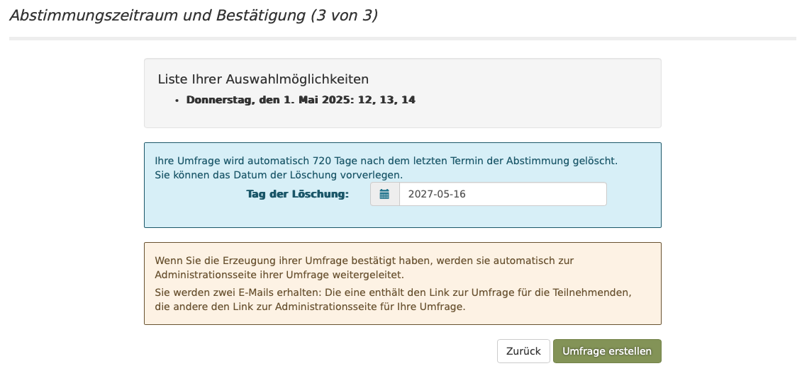
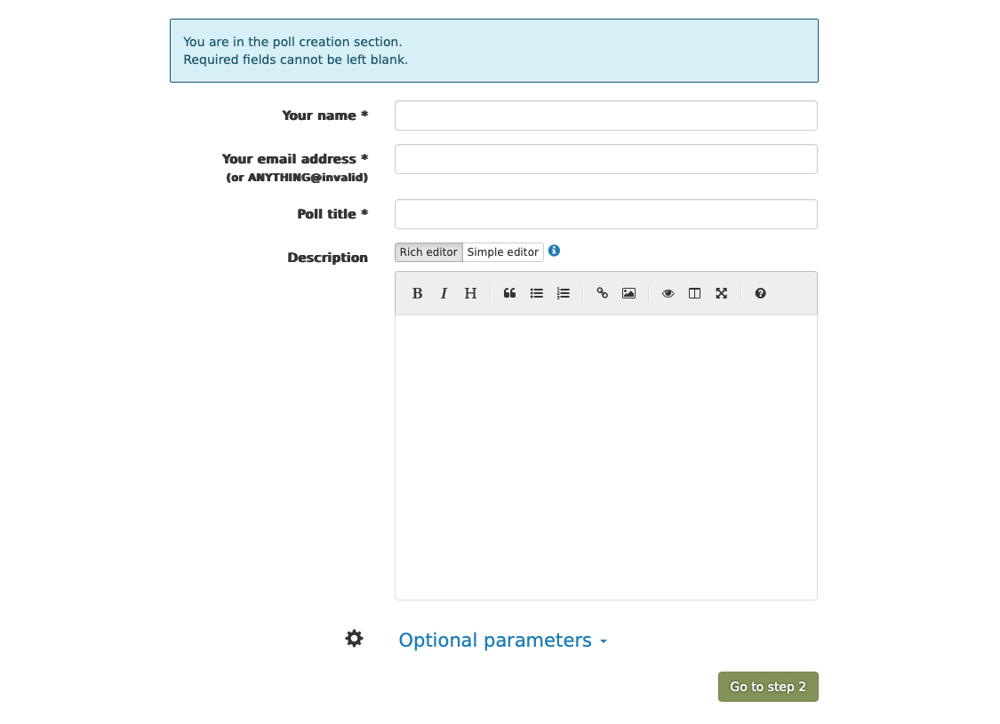

# requirement 6
as a user i want to be able to go from the step-2 page to the next form page to finalize the event.
 
## acceptance criteria
1. if the user is still on the second form  and clicks on the "next" button, the 3nd step form appears
2. the layout of the step 3 form should look similar to  
3. if the user clicks the "back" button, the previous from  appears again including the data he already has entered
4. the "Expiry Date" defaults to a date which is calculated this way:
    * take the date from step 2 and add 3 month 
5. this new step 3 should have also a back button as the stages before and a "create the poll" button which would show a summary of the event. (but this new summary page will be defined in a new requirement)  