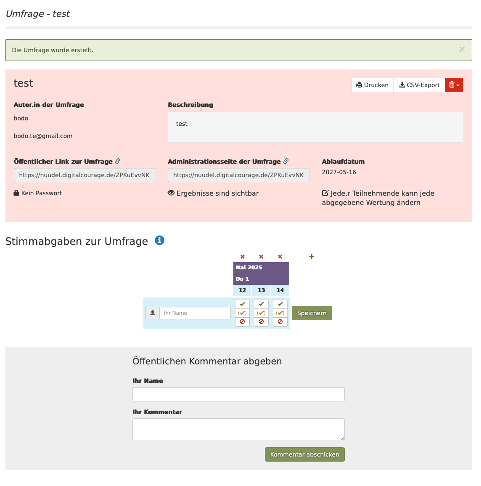

# requirement 7
as the user after the last test creating an event poll i want to see the summary of my data, and want to have all entered data be saved for later use. 

# acceptance criteria
* a summary of the previous entered data form all 3 steps is shown on similar to  
* the data are stored in a S3-compatible store, with the object ID using a UUID. 
* The UUID is used to create a event URL containing the current server URL (take "http://localhost:8080" for now), the path "event" and the UUID. For example if UUID is "123e4567-e89b-12d3-a456-426614174000" then the event URL shown on the summary page would be http://localhost:8080/event/123e4567-e89b-12d3-a456-426614174000

# hints
* assume a locally running MinIO al the S3 compatible store
* the S3 store URL is "http://localhost:9000" and should be configured in the "application.yml" 
* the S3 bucketname to be used should also be configured in the "application.yml" , set to "de.bas.bodo"
  